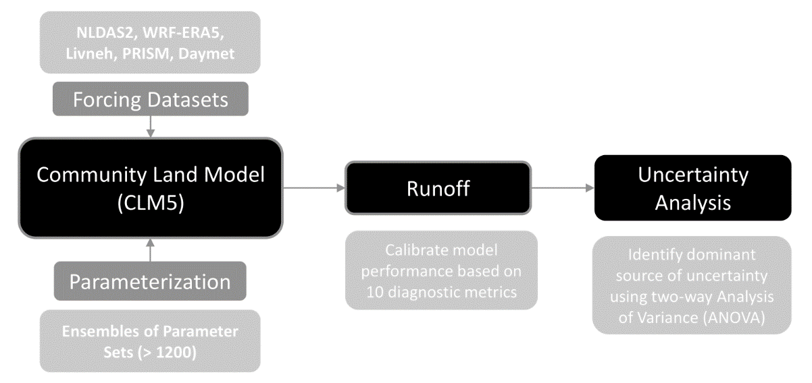

# eldardiry-etal\_2025\_james

**[Characterizing How Meteorological Forcing Selection and Parameter Uncertainty Influence Community Land Model Version 5 Hydrological Applications in the United States](https://doi.org/10.1029/2024MS004222)**

Hisham Eldardiry1\*, Ning Sun1, Hongxiang Yan1, Patrick Reed2, Travis Thurber1, and Jennie Rice1

1  Pacific Northwest National Laboratory, Richland, WA, USA.

2  Department of Civil and Environmental Engineering, Cornell University, Ithaca, NY, USA

\* Corresponding author:  Hisham Eldardiry [\<hisham.eldardiry@pnnl.gov\>](mailto:hisham.eldardiry@pnnl.gov)

## Abstract
Despite the increasing use of large-scale Land Surface Models (LSMs) in predicting hydrological responses in extreme conditions, there's a critical gap in understanding the uncertainties in these predictions. This study addresses this gap through a detailed diagnostic evaluation of the uncertainties arising from meteorological forcing selection and model parametrization in hydrological simulations of the Community Land Model version 5 (CLM5). CLM5 is configured at a spatial scale of about 12-km to simulate runoff processes for 464 headwater watersheds, selected from the Catchment Attributes for Large-Sample Studies (CAMELS) data set to be representative of physiographic and climatic gradients across the conterminous United States. For each watershed, CLM5 is driven by five commonly used gridded forcing data sets in combination with a large ensemble (>1,200) of key CLM5 hydrologic parameters. Our results suggest that uncertainty in CLM5 runoff simulations resulting from both forcing and parametric sources is markedly higher in arid regions, for example, Great Plains and Midwest regions. Uncertainty in low flow is dominated by parametric uncertainty, while the selection of meteorological forcing contributes more dominantly to high flow and seasonal flows during fall and spring. Our analysis also demonstrates that the selection of forcing data sets and the metrics used to calibrate CLM5 significantly impact the model's predictive accuracy in extreme event severity for both floods and droughts. Overall, the results from this study highlight the need to understand and account for forcing and parametric uncertainties in CLM5 simulations, particularly for hazard and risk assessments addressing hydrologic extremes.

## Journal reference
Eldardiry, H., Sun, N., Yan, H., Reed, P., Thurber, T., and Rice, J. (2025). Characterizing How Meteorological Forcing Selection and Parameter Uncertainty Influence Community Land Model Version 5 Hydrological Applications in the United States. Journal of Advances in Modeling Earth Systems, 17(3), e2024MS004222. [https://doi.org/10.1029/2024MS004222](https://doi.org/10.1029/2024MS004222)

## Data reference

### Input data
|       Dataset       |               URL                |               DOI                |
|:-------------------:|:--------------------------------------------:|:--------------------------------:|
|   CAMELS    | https://gdex.ucar.edu/dataset/camels.html | https://dx.doi.org/10.5065/D6MW2F4D, https://doi.org/10.5065/D6G73C3Q |
|   NLDAS-2  | https://disc.gsfc.nasa.gov/datasets?keywords=NLDAS | various |
|   Livenh    | https://climatedataguide.ucar.edu/climate-data/livneh-gridded-precipitation-and-other-meteorological-variables-continental-us-mexico | https://doi.org/10.1038/sdata.2015.42, https://doi.org/10.7289/v5x34vf6 |
|  PRISM | https://prism.oregonstate.edu/ | N/A |
|  Daymet | https://daymet.ornl.gov/ | https://doi.org/10.3334/ORNLDAAC/2129 |
| TGW-WRF | https://tgw-data.msdlive.org/ | https://doi.org/10.1038/s41597-023-02485-5, https://doi.org/10.57931/1885756 |
| Behavioral Ensemble CLM5 Hydrological Parameter Sets | https://doi.org/10.57931/2274938 | https://doi.org/10.57931/2274938 |

### Output data
| Dataset | URL | DOI |
|:-------:|:---:|:---:|
| CLM5 CAMELS basin ensemble simulations | https://data.msdlive.org/records/5rpkv-h8n12 | https://doi.org/10.57931/1922953 |

## Contributing modeling software
| Model | Version | URL | DOI |
|:-----:|:-------:|:---:|:---:|
| CLM5  |  im3v1.0.0 | https://github.com/IMMM-SFA/im3-clm | https://doi.org/10.5281/zenodo.6653705 |
| MetSim | 2.4.4 | https://github.com/UW-Hydro/MetSim | https://doi.org/10.5281/zenodo.10076270 |

## Reproduce my experiment
Clone the [IM3-CLM5 repository](https://github.com/IMMM-SFA/im3-clm) to set up the CLM5 model, you will need to download the five forcing datasets and convert them into NetCDF format. You will also need to generate ensemble hydrological parameter value files using parameter values at https://doi.org/10.57931/2274938. The [output data repository](https://doi.org/10.57931/1922953) already contains the ensemble output from the CLM5 model so you can skip rerunning the CLM5 model if you want to save time.

## Reproduce my figures
| Figure Numbers | Script Name | Description | Figure |
|:--------------:|:-----------:|:-----------:|:------:|
| 1  | manually created | Experiment workflow diagram |  |
| 2  | `./figures/Figure_2.py` | The location of the 464 CAMELS basins and their characteristics |  |
| 3  | `./figures/Figure_3.py` | The five meteorological datasets |  |
| 4  | `./figures/Figure_4.py`| The CLM5 simulations using default and best parameters |  |
| 5  | `./figures/Figure_5.py` | The calibration skill score for CLM5 simulations |  |
| 6  | `./figures/Figure_6.py` | The total uncertainty for each basin and cluster |  |
| 7  | `./figures/Figure_7.py` | The relative contributions of uncertainties |  |
| 8  | `./figures/Figure_8.py` | The runoff empirical cumulative distributions for selected basins |  |
| 9  | `./figures/Figure_9.py` | The total volume and total evapotranspiration for the selected basins |  |
| 10 | `./figures/Figure_10.py` | The heatmaps of drought classification for the selected basins |  |
| 11 | `./figures/Figure_11.py` | The four hydrological parameters for the selected basins |  |
| 12 | `./figures/Figure_12.py` | The uncertainty contributions for each region |  |
